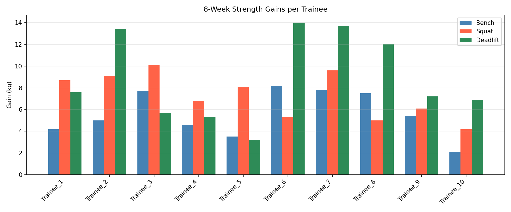
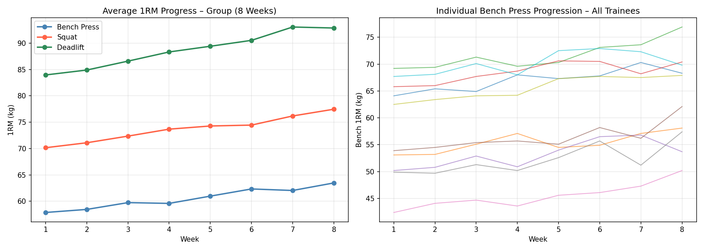

# Fitness Progress Tracker

## Overview

This project analyzes fitness data to track progress over time and generate meaningful insights. It helps monitor improvements in strength, consistency, and overall performance using data visualization techniques.

## Features

* Track workout progress over time
* Analyze strength and performance trends
* Visualize individual and group fitness progress
* Generate data-driven insights for training improvement

## Tech Stack

* Python
* Pandas
* NumPy
* Matplotlib

---

## Dataset

* Fitness tracking dataset containing workout logs
* Includes parameters like reps, weights, and performance metrics
* Inclded dataset: [fitness_log.csv](fitness_log.csv)

## Output

### Individual Progress

### Group Progress

## Results

* Identified trends in fitness performance over time
* Visualized improvements in strength and consistency
* Enabled better planning using data-driven insights

## Project Highlights

* Combines fitness knowledge with data analysis
* Demonstrates practical data visualization skills
* Useful for tracking and improving workout performance
